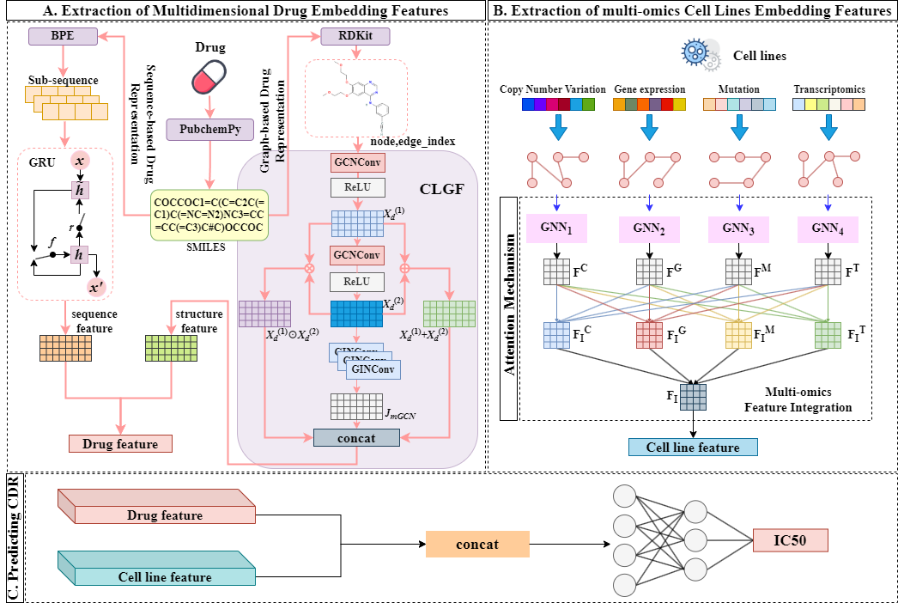

# DeepKGI
DeepKGI: Drug Response Prediction with Cross-Layer Graph Fusion and Key Gene Identification

## Requirements
- Please install the environment using anaconda3;  
  conda create -n DeepKGI python=3.7
- Install the necessary packages. 
  
  torch == 1.8.0   

  torch-cluster == 1.5.9

  torch-scatter == 2.0.8 

  torch-sparse == 0.6.9

  torch-spline-conv == 1.2.1 

  torch-geometric == 2.3.1 

  rdkit == 2023.3.2

# Overview

- `data/`: Contains the required dataset files.
- `models/`: Implementation of the DeepKGI model.
- `utils/`: Utility functions and data processing subroutines.
- `preprocess_gene.py`: Preprocessing script for genetic profiles.
- `smiles2graph.py`: Constructs molecular graphs from SMILES strings.
- `main.py`: Train or test the DeepKGI model.

## Model Training/Testing
- You can run `python main.py --mode "train"` to train DeepKGI or run `python main.py --mode "test"` to test trained DeepKGI.
